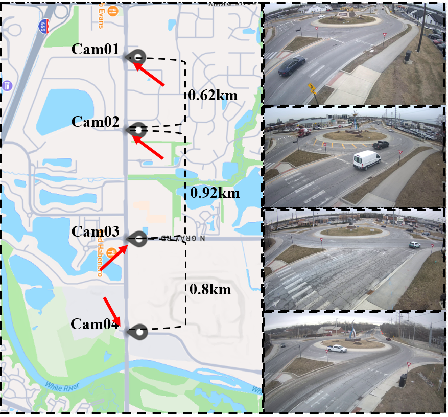

# RoundaboutHD

**RoundaboutHD** is a comprehensive, high-resolution multi-camera vehicle tracking (MCVT) dataset captured in a real-world roundabout scenario. It is designed to support the development and benchmarking of object detection, single-camera tracking (SCT), and multi-camera vehicle tracking (MCVT) algorithms in urban environments with nonlinear motion and frequent occlusions.


---

## Dataset Description

RoundaboutHD provides **40 minutes of fully annotated video footage** recorded from **4 non-overlapping 4K cameras at 15 FPS**. Each camera covers 10 minutes of traffic under various conditions: normal, light, and heavy traffic. The roundabout layout introduces significant challenges such as:

- **Nonlinear vehicle trajectories**
- **Frequent occlusions** due to infrastructure (e.g., a central statue)
- **Multiple exits and intersections** between cameras

This makes RoundaboutHD a challenging yet realistic benchmark for evaluating vehicle tracking performance in smart city applications.

---

## Dataset Access

To request access to the dataset, please email your **full name** and **institutional affiliation** to:

**yl4300@bath.ac.uk**

The dataset is available for **non-commercial research purposes only**. It will also be published through the **University of Bath Research Data Archive** in the near future.

---

## Dataset Contents

The dataset includes:

- **Labeled video footage**
- **Object detection results**
- **Single-camera tracking (SCT) results**
- **Multi-camera tracking (MCVT) results**
- **Evaluation scripts and label format documentation**

---

## Evaluation

We provide tools for evaluating tracking performance in this repository:  
[Multi-Camera Tracking Labelling Tool](https://github.com/siri-rouser/multi_camera_tracking_labelling_tool.git)

### Multi-Camera Tracking Evaluation

Use the following command:

```bash
python eval_label.py <prediction_file> <ground_truth_file>
```

Each line in the prediction/ground-truth file should follow this format:

```
<camera_id> <obj_id> <frame_id> <xmin> <ymin> <width> <height> <xworld> <yworld>
```

**Descriptions:**

- `camera_id`: Integer identifier (1–4 in RoundaboutHD)
- `obj_id`: Object ID (positive integer, consistent across cameras)
- `frame_id`: Frame number (starting at 0)
- `xmin`, `ymin`, `width`, `height`: Bounding box coordinates (pixels)
- `xworld`, `yworld`: GPS/world coordinates of the object (optional)

> *Note: `xworld` and `yworld` are not required for evaluation, but including them is recommended for future extensions.*

---

### Single-Camera Tracking Evaluation

Use the following command:

```bash
python eval_det.py <prediction_file> <ground_truth_file>
```
Each line in the prediction/ground-truth file should follow this format:
```
<frame_id> <obj_id> <xmin> <ymin> <xmax> <ymax>
```

**Descriptions:**
The definition of each item is as same as the multi-camera tracking format.

### Object Detection Evaluation
Use the following command:

```bash
python eval_sct.py <prediction_directory> <ground_truth_directory>
```
Each directory should contain multiple `.txt` files named by frame with format f'img{frame_id:06d}.txt', example as below:

```
img000000.txt, img000001.txt, ...
```

Each file must contain object detections in the format:

```
<class_id> <xmin> <ymin> <xmax> <ymax>
```
**Descriptions:**
`class_id` corresponds to the category names pre-defined in the COCO dataset.
> *Note: The value of `class_id` do not influence the results for object detection evaluation.

---

## Citation

If you use **RoundaboutHD** in your research, please cite the following:

> **Yuqiang Lin**, **Sam Lockyer**, **Mingxuan Sui**, and **Nic Zhang**  
> *RoundaboutHD: A High-Resolution Benchmark Dataset for Real-World Multi-Camera Vehicle Tracking*  
> arXiv preprint arXiv:XXXX.XXXXX, 2025.  
> [URL to be updated after arXiv submission]

---

## Contact

For questions or collaboration inquiries, feel free to reach out:  
**yl4300@bath.ac.uk**

