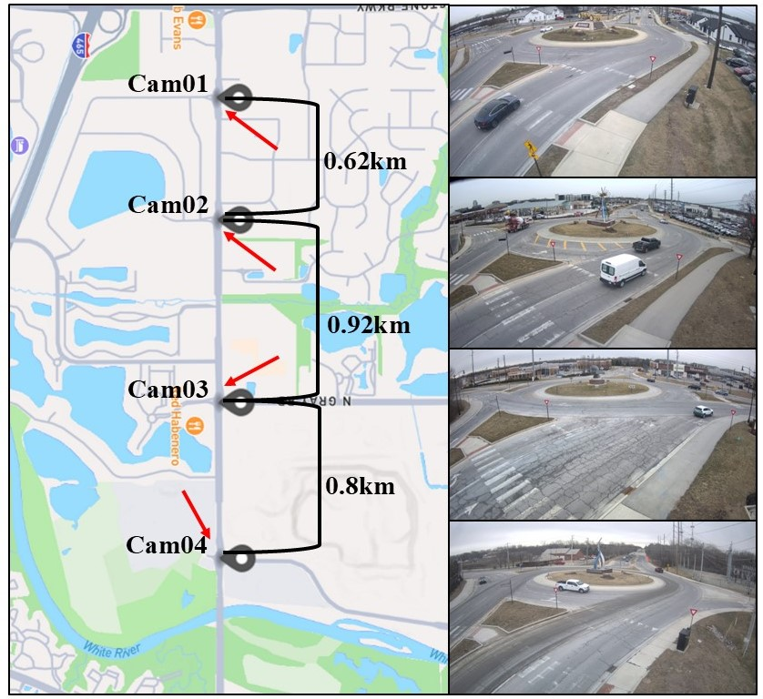

# RoundaboutHD:High-Resolution Real-World Urban Environment Benchmark for Multi-Camera Vehicle Tracking

[](https://arxiv.org/abs/2507.08729)

**RoundaboutHD** is a comprehensive, high-resolution multi-camera vehicle tracking (MCVT) dataset captured in a real-world roundabout scenario. It is designed to support the development and benchmarking of object detection, single-camera tracking (SCT), and multi-camera vehicle tracking (MCVT) algorithms in urban environments with nonlinear motion and frequent occlusions.

<p align="center">
    
</p>


## Dataset Access

To request access to the dataset, please email your **full name** and **institutional affiliation** to: **yl4300@bath.ac.uk**. The dataset is available for **non-commercial research purposes only**. It will also be published through the **University of Bath Research Data Archive** in the near future.

---


## Dataset Description

RoundaboutHD provides **40 minutes of fully annotated video footage** recorded from **4 non-overlapping 4K cameras at 15 FPS**. Each camera covers 10 minutes of traffic under various conditions: normal, light, and heavy traffic. The roundabout layout introduces significant challenges such as:

- **Nonlinear vehicle trajectories**
- **Frequent occlusions** due to infrastructure (e.g., a central statue)
- **Multiple exits and intersections** between cameras

This makes RoundaboutHD a challenging yet realistic benchmark for evaluating vehicle tracking performance in smart city applications.

---

## Dataset Contents

The dataset structure:
```
RoundaboutHD/
├── imagesc001/  ← Same structure applies to imagesc002, imagesc003, imagesc004
│   ├── detection/
│   │   ├── labels_GT.zip/
│   │   │   ├── img000000.txt
│   │   │   ├── ...
│   │   │   └── img008999.txt  # Total: 9000 files
│   │   ├── labels_test.zip/
│   │   └── labels_xy.zip/
│   ├── SCT/
│   │   └── imagesc001_SCT_GT.txt
│   ├── geo-mapping/
│   │   ├── cam01_fitted_cam.json
│   │   ├── cam01_info.png
│   │   ├── cam01_topview.jpg
│   │   ├── cam01_trace.png
│   │   └── cam01_undistorted.png
│   └── video.mp4
├── imagesc002/
├── imagesc003/
├── imagesc004/
├── ReID_subset/
│   └── ReID_subset.zip/
│       ├── query_images/
│       ├── test_images/
│       └── train_images/
├── Multi_CAM_Ground_Truth.txt
└── vehicle_statistic.xlsx
```
In this dataset, it contains:
- **Labeled video footage** 
- **Object detection Ground Turth**
- **Single-camera tracking (SCT) Ground Turth**
- **camera modelling parameter and visualization**
- **RoundaboutHD image-based ReID subset**
- **Image-based ReID Ground Turth**
- **Multi-camera tracking (MCVT) Ground Turth**
- **Vehicle context information**
- **Evaluation scripts and label format documentation**
---

## Evaluation

We provide tools for evaluating tracking performance in this repository:  
[Multi-Camera Tracking Labelling Tool](https://github.com/siri-rouser/multi_camera_tracking_labelling_tool.git)

### Multi-Camera Tracking Evaluation

Use the following command:

```bash
python eval_label.py <prediction_file> <ground_truth_file>
```

Each line in the prediction/ground-truth file should follow this format:

```
<camera_id> <obj_id> <frame_id> <xmin> <ymin> <width> <height> <xworld> <yworld>
```

**Descriptions:**

- `camera_id`: Integer identifier (1–4 in RoundaboutHD)
- `obj_id`: Object ID (positive integer, consistent across cameras)
- `frame_id`: Frame number (starting at 0)
- `xmin`, `ymin`, `width`, `height`: Bounding box coordinates (pixels)
- `xworld`, `yworld`: GPS/world coordinates of the object (optional)

> *Note: The value of `xworld` and `yworld` do not count into the evaluation, you can use the value -1 as placehold.
---

### Single-Camera Tracking Evaluation

Use the following command:

```bash
python eval_det.py <prediction_file> <ground_truth_file>
```
Each line in the prediction/ground-truth file should follow this format:
```
<frame_id> <obj_id> <xmin> <ymin> <xmax> <ymax>
```

**Descriptions:**
The definition of each item is as same as the multi-camera tracking format.

### Object Detection Evaluation
Use the following command:

```bash
python eval_sct.py <prediction_directory> <ground_truth_directory>
```
Each directory should contain multiple `.txt` files named by frame with format f'img{frame_id:06d}.txt', example as below:

```
img000000.txt, img000001.txt, ...
```

Each file must contain object detections in the format:

```
<class_id> <xmin> <ymin> <xmax> <ymax>
```
**Descriptions:**
`class_id` corresponds to the category names pre-defined in the COCO dataset.
> *Note: The value of `class_id` do not influence the results for object detection evaluation.

---
## Baseline

We evaluate our dataset using **ELECTRICITY** [1], a general and reproducible MCVT method. We set the **distance threshold** to **12** and apply a **hard removal distance** of **80**. Static vehicle trajectories are removed. The result is shown below:

| Dataset           | IDF1  | IDP   | IDR   |
|-------------------|-------|-------|-------|
| **RoundaboutHD**  | 28.14 | 26.45 | 30.06 |

---

## Citation

If you use **RoundaboutHD** in your research, please cite:

```
@misc{lin2025roundabouthdhighresolutionrealworldurban,
      title={RoundaboutHD: High-Resolution Real-World Urban Environment Benchmark for Multi-Camera Vehicle Tracking}, 
      author={Yuqiang Lin and Sam Lockyer and Mingxuan Sui and Li Gan and Florian Stanek and Markus Zarbock and Wenbin Li and Adrian Evans and Nic Zhang},
      year={2025},
      eprint={2507.08729},
      archivePrefix={arXiv},
      primaryClass={cs.CV},
      url={https://arxiv.org/abs/2507.08729}, 
}
```

---

[1] Y. Qian et al., "ELECTRICITY: An Efficient Multi-Camera Vehicle Tracking System for Intelligent City", CVPRW, 2020.